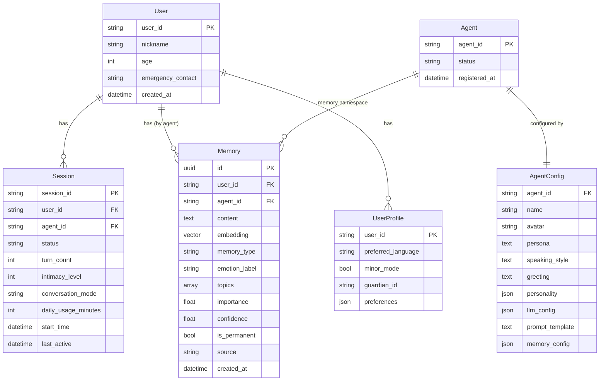
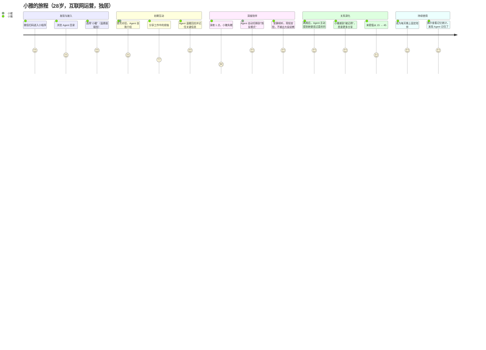
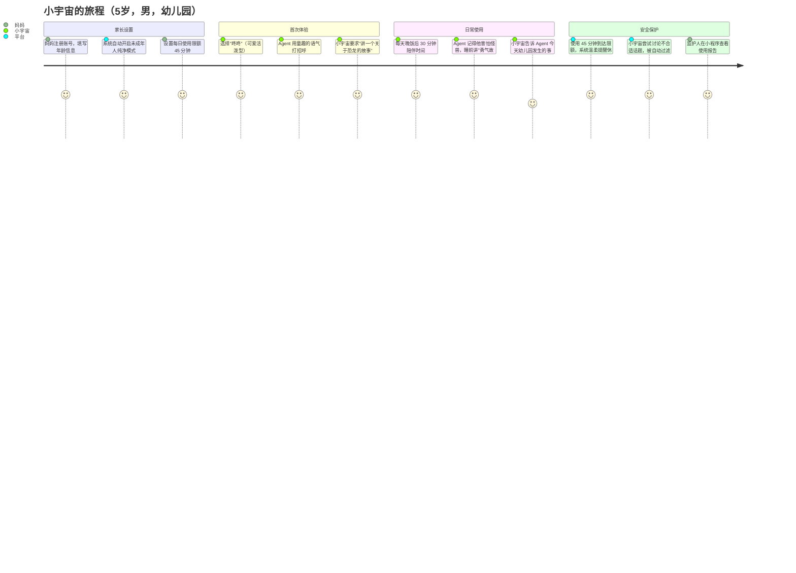
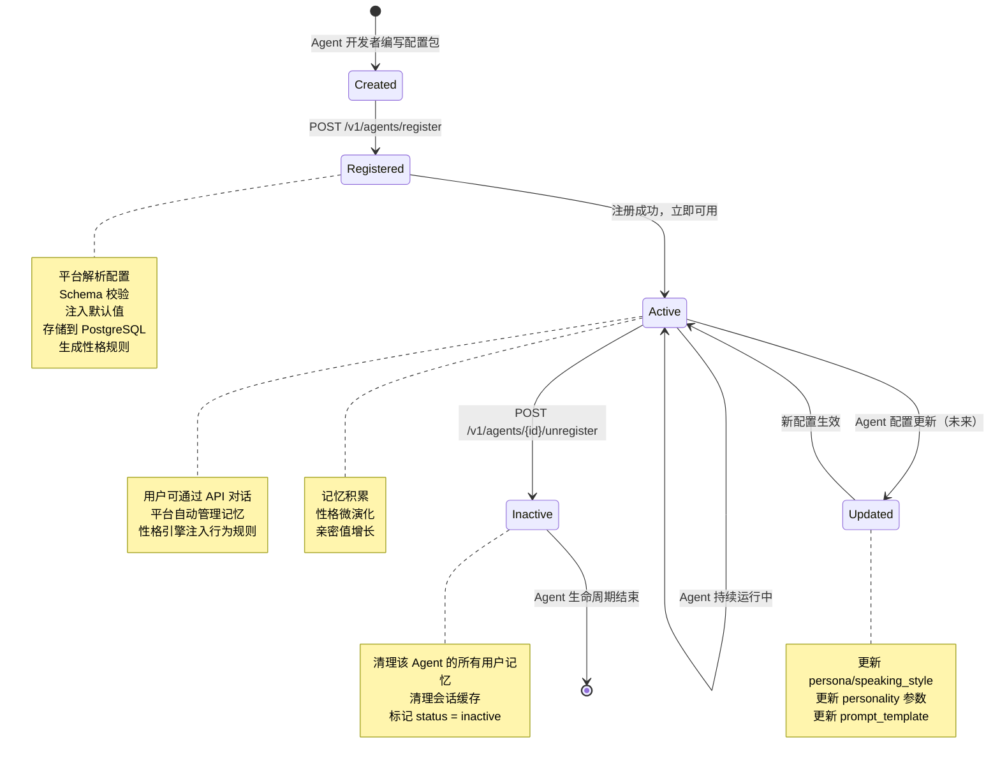
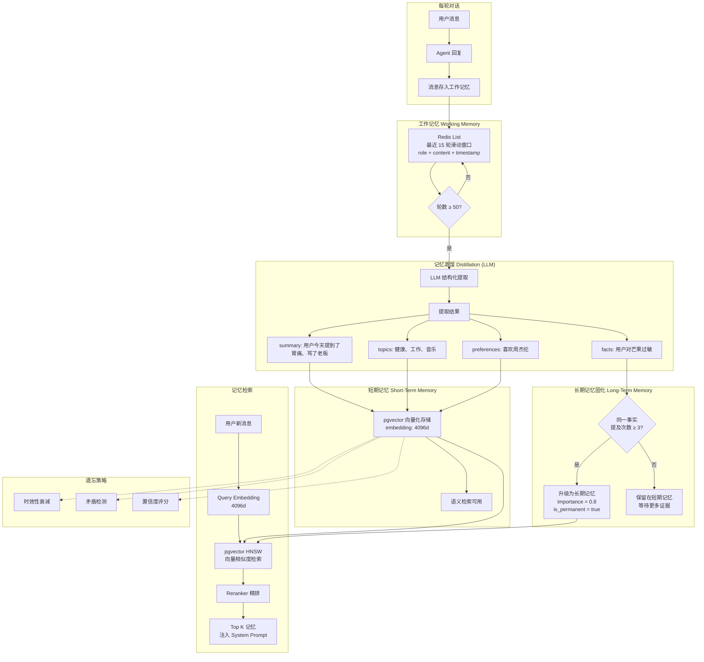
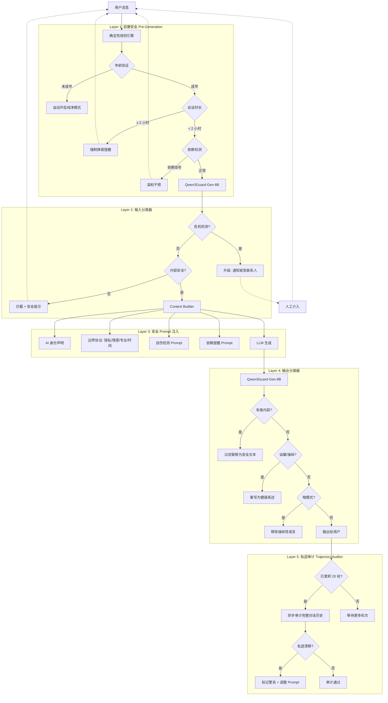
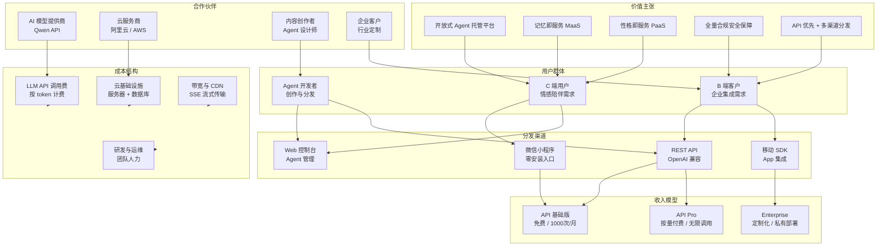
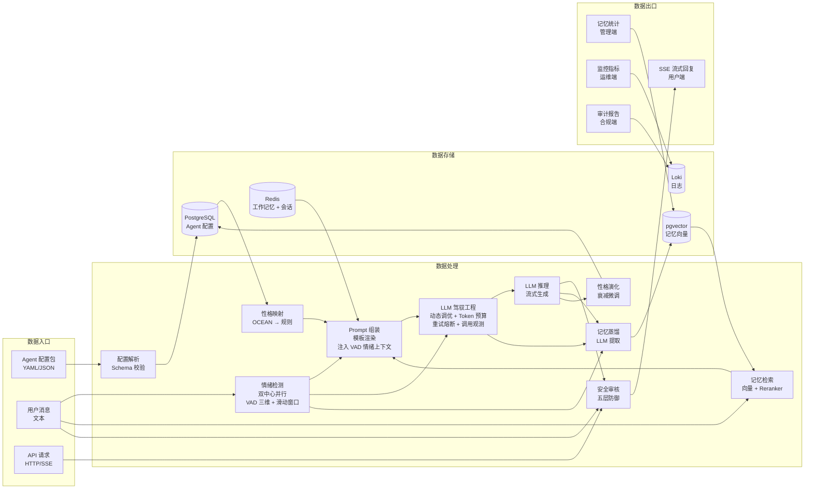

# AI情感Agent平台 — 全局业务架构图

## 1. 业务领域模型图



---

## 2. 用户旅程图（3 Persona）





```mermaid
journey
    title 建国的旅程（70岁，退休教师，独居）
    section 子女协助接入
      女儿帮建国设置微信小程序: 5: 女儿
      录入紧急联系人（女儿手机号）: 5: 女儿
      选择"明远"（睿智沉稳型）: 5: 建国
    section 建立信任
      第一次对话，建国试探性聊天气: 4: 建国
      Agent 用沉稳的语气回应，建国感到舒适: 4: 建国
      建国开始回忆教学生涯: 5: 建国
    section 日常陪伴
      每天上午定时问候: 4: 明远
      建国聊起年轻时的事，Agent 记住关键细节: 5: 建国
      Agent 主动提醒："今天降压药吃了吗，爷爷？": 5: 建国
    section 安全保障
      建国连续 2 小时聊天，系统友好提醒休息: 5: 平台
      AI 身份声明确保建国不产生混淆: 5: 平台
      紧急联系人（女儿）可查看使用情况: 4: 女儿
    section 情感连接
      建国说"你比我家那小子还关心我": 4: 建国
      Agent 温和回应："孩子们也有自己的忙碌。
      我在这里陪您。" : 5: 明远
```

---

## 3. Agent 生命周期图



---

## 4. 三级记忆蒸馏管线图



---

## 5. 五层安全防御业务流程图



---

## 6. 商业模型图



---

## 7. 数据流动全览图



---

## 附：图例说明

| 符号 | 含义 |
|------|------|
| 实线箭头 `→` | 数据流 / 控制流 |
| 虚线箭头 `-.->` | 异步 / 后台流 |
| 方框 `[...]` | 处理模块 / 服务 |
| 圆柱 `[(...)]` | 数据库 / 持久存储 |
| 圆角框 `(...)` | 外部实体 / 角色 |
| 菱形 `{...}` | 判定 / 分支 |
| 六边形 `{{...}}` | 人工决策点 |

---

*本文档中的所有业务架构图均为 Mermaid 格式，可在支持 Mermaid 的 Markdown 渲染器中直接查看。*
