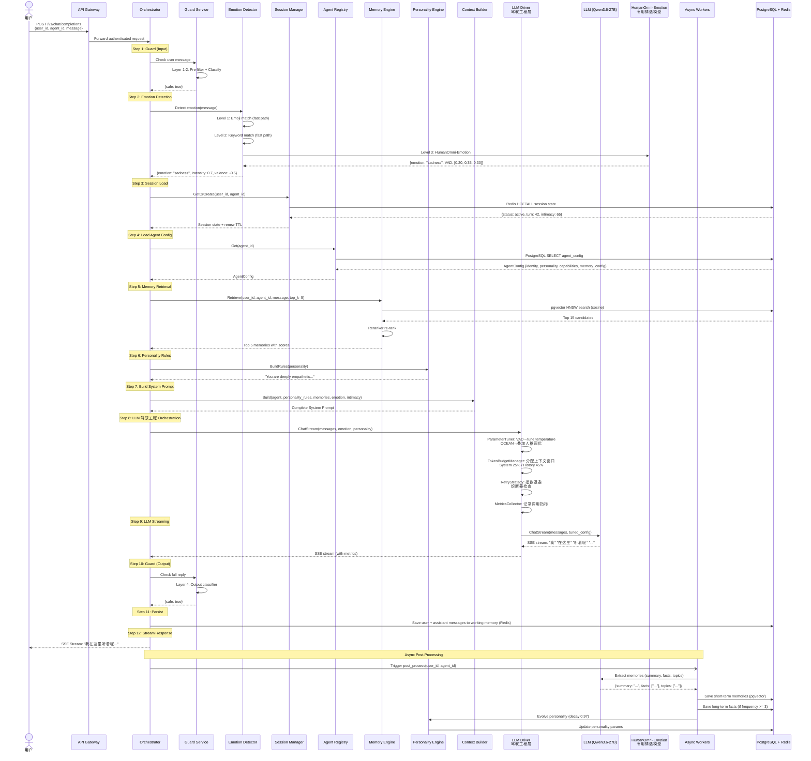
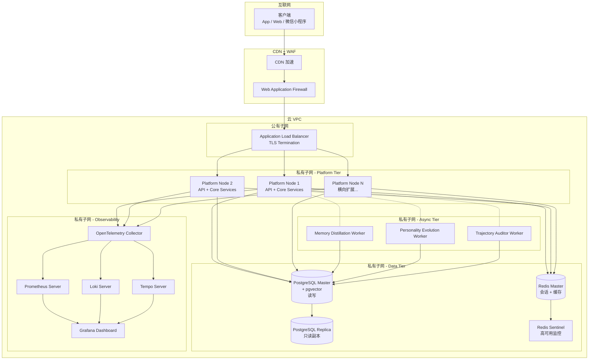
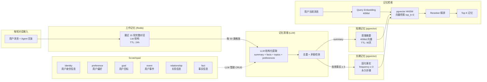

# AI情感Agent平台 — 全局技术架构图

## 1. 系统拓扑架构图

```mermaid
graph TB
    subgraph External["外部世界"]
        DEV[Agent 开发者<br/>注册/管理 Agent]
        USER[终端用户<br/>与 Agent 对话]
        SDK[第三方集成<br/>API/SDK 接入]
    end

    subgraph Gateway["API Gateway 层"]
        LB[负载均衡器]
        GW[API Gateway<br/>TLS 1.3 + API Key 认证<br/>速率限制 + CORS]
    end

    subgraph Core["Platform Core 核心层"]
        REG[Agent Registry<br/>Agent 注册中心<br/>生命周期管理]
        ORCH[Conversation Orchestrator<br/>对话编排器<br/>12-step 统一管线]
        
        subgraph Services["平台服务"]
            MEM[Memory Engine<br/>记忆即服务 MaaS<br/>三级记忆蒸馏]
            PER[Personality Engine<br/>性格即服务 PaaS<br/>大五人格 + 演化]
            CTX[Context Builder<br/>上下文组装<br/>System Prompt 渲染]
            GD[Guard Service<br/>安全审核<br/>五层防御]
            EMO[Emotion Detector<br/>情绪感知<br/>6 类 + 5 模式]
            SES[Session Manager<br/>会话管理<br/>状态 + TTL]
            PRM[Prompt Manager<br/>模板管理<br/>占位符渲染]
        end
        
        subgraph Driver["LLM 驾驭工程层"]
            DRV[LLMDriver<br/>动态参数调优 + Token 预算<br/>重试熔断 + 调用观测]
            TUN[ParameterTuner<br/>VAD + OCEAN → Temperature]
            BUD[TokenBudgetManager<br/>System 25% / History 45%]
            RET[RetryStrategy<br/>指数退避 + 熔断器]
            MET[MetricsCollector<br/>延迟/令牌/成功率/调优原因]
        end
    end

    subgraph Framework["pkg/ Framework 框架层"]
        FACE[Agent Builder<br/>Builder 模式<br/>Agent 组合]
        FPIP[Pipeline<br/>中间件链<br/>6 内置中间件]
        FPRO[Provider Interfaces<br/>LLM/Embedding/Guard<br/>可插拔接口]
        FTYPES[Types<br/>OCEAN/Identity/Memory<br/>共享数据类型]
    end

    subgraph AI["AI Model 模型层"]
        LLM[LLM<br/>Qwen3.6-27B<br/>对话生成]
        EMB[Embedding<br/>Qwen3-Embedding-8B<br/>4096d 向量化]
        RER[Reranker<br/>Qwen3-Reranker-8B<br/>记忆精排]
        GRD[Guard Model<br/>Qwen3Guard-Gen-8B<br/>内容安全]
        EMO_MODEL[HumanOmni-Emotion<br/>专用情感模型<br/>7B LoRA + 4-bit 量化]
    end

    subgraph Training["训练管线"]
        SFT[SFT: 三阶段微调<br/>Phase A: 情感分类<br/>Phase B: VAD 回归<br/>Phase C: 对抗鲁棒性]
        RL[RLHF: PPO 强化学习<br/>Reward Model: Qwen2.5-0.5B]
        QUANT[模型量化<br/>4-bit NF4 + vLLM 部署]
    end

    SFT --> RL --> QUANT --> EMO_MODEL

    subgraph Data["Data 数据层"]
        PG[(PostgreSQL<br/>+ pgvector<br/>Agent 配置 + 记忆向量)]
        RD[(Redis<br/>工作记忆<br/>会话状态 + 速率限制)]
        LK[(Loki<br/>日志聚合)]
    end

    subgraph Async["Async Workers 异步层"]
        DIST[Memory Distillation<br/>记忆蒸馏 Worker]
        EVOL[Personality Evolution<br/>性格演化 Worker]
        AUDIT[Trajectory Auditor<br/>轨迹审计 Worker Layer 5]
    end

    subgraph OBS["Observability 可观测性"]
        OTEL[OpenTelemetry<br/>Collector]
        TRACE[Tempo<br/>分布式追踪]
        METRICS[Prometheus<br/>指标采集]
        GRAF[Grafana<br/>监控仪表盘]
    end

    DEV --> GW
    USER --> GW
    SDK --> GW
    GW --> LB
    LB --> ORCH
    LB --> REG
    
    ORCH --> REG
    ORCH --> MEM
    ORCH --> PER
    ORCH --> CTX
    ORCH --> GD
    ORCH --> EMO
    ORCH --> SES
    ORCH --> PRM
    
    ORCH --> DRV
    DRV --> LLM
    DRV --> TUN
    DRV --> BUD
    DRV --> RET
    DRV --> MET
    ORCH --> Framework
    Framework --> FACE
    Framework --> FPIP
    Framework --> FPRO
    Framework --> FTYPES
    FPRO --> LLM
    FPRO --> EMB
    FPRO --> RER
    FPRO --> GRD
    FPRO --> EMO_MODEL
    MEM --> EMB
    MEM --> RER
    GD --> GRD
    EMO -->|Level 3| EMO_MODEL
    
    REG --> PG
    MEM --> PG
    MEM --> RD
    SES --> RD
    
    ORCH -.-> DIST
    ORCH -.-> EVOL
    ORCH -.-> AUDIT
    DIST --> LLM
    DIST --> PG
    EVOL --> PG
    AUDIT --> LLM
    
    ORCH --> OTEL
    OTEL --> TRACE
    OTEL --> METRICS
    OTEL --> LK
    TRACE --> GRAF
    METRICS --> GRAF
    LK --> GRAF
```



---

## 2. 对话管线数据流图（12-Step Pipeline with LLM 驾驭工程）



---

## 3. 部署基础设施架构图



---

## 4. 内存记忆管线架构图



---

## 5. 组件交互关系图

```mermaid
graph TB
    subgraph External["外部接口"]
        API[Chat API<br/>POST /v1/chat/completions]
        REG_API[Agent API<br/>POST /v1/agents]
        MEM_API[Memory API<br/>GET /v1/memories/stats]
    end

    subgraph Handler["Handler 层"]
        CH[ChatHandler<br/>SSE stream / non-stream]
        AH[AgentHandler<br/>Register / Unregister / List / Get]
        MH[MemoryHandler<br/>Stats / Clear]
    end

    subgraph Pipeline["Pipeline 层"]
        CP[ChatPipeline<br/>Chat() + ChatNonStream()]
    end

    subgraph Framework["pkg/ Framework 框架层"]
        AGENT[Agent Builder<br/>Builder 模式]
        PL[Pipeline<br/>中间件链]
        PROV[Provider Interface<br/>LLM/Embedding/Guard]
        TYPES[Types<br/>共享数据类型]
    end

    subgraph Core["Core Services"]
        REG_SVC[AgentRegistry<br/>agents map + RWMutex]
        MEM_SVC[MemoryEngine<br/>working + short + long + pgvector]
        PER_SVC[PersonalityEngine<br/>BuildRules + Evolve]
        DRV_SVC[LLMDriver<br/>Tuner + Budget + Retry + Metrics]
        LLM_CLI[LLMClient<br/>Chat + ChatStream + Embed + GuardCheck]
        SES_SVC[SessionManager<br/>Redis state + TTL]
        EMO_SVC[EmotionDetector<br/>keyword + LLM fallback]
    end

    subgraph Store["Store 层"]
        PG_STORE[PostgresStore<br/>agent_registry + agent_memories]
        REDIS_STORE[RedisStore<br/>sessions + working memory]
    end

    subgraph Model["Model 层"]
        AGENT_M[AgentConfig<br/>Identity + Personality + Capabilities]
        MEM_M[MemoryEntry<br/>Content + Embedding + Type]
        MSG_M[Message<br/>Role + Content]
        EMO_M[EmotionResult<br/>Emotion + Intensity + Valence]
    end

    subgraph EmotionModel["专用情感模型"]
        EMO_PROV[EmotionProvider<br/>统一接口<br/>Classify + ClassifyVAD]
        HUMANOMNI[HumanOmni-Emotion<br/>7B LoRA + 4-bit NF4<br/>独立 GPU 推理]
        RM[Reward Model<br/>Qwen2.5-0.5B<br/>评分器]
    end

    API --> CH
    REG_API --> AH
    MEM_API --> MH

    CH --> PL
    CH --> FPIP
    MH --> MEM_SVC

    FPIP --> REG_SVC
    FPIP --> MEM_SVC
    FPIP --> PER_SVC
    FPIP --> PROV
    FPIP --> SES_SVC
    FPIP --> EMO_SVC
    FPIP --> DRV_SVC

    PROV --> LLM_CLI

    CP --> REG_SVC
    CP --> MEM_SVC
    CP --> PER_SVC
    CP --> DRV_SVC
    CP --> LLM_CLI
    CP --> SES_SVC
    CP --> EMO_SVC

    AH --> REG_SVC
    REG_SVC --> PG_STORE
    MEM_SVC --> PG_STORE
    MEM_SVC --> REDIS_STORE
    SES_SVC --> REDIS_STORE

    REG_SVC -.-> AGENT_M
    MEM_SVC -.-> MEM_M
    CP -.-> MSG_M
    EMO_SVC -.-> EMO_M
    EMO_SVC -->|Level 3| EMO_PROV
    EMO_PROV --> HUMANOMNI
    HUMANOMNI -.-> RM
    LLM_CLI -.-> MSG_M
```

---

## 附：图例说明

| 符号 | 含义 |
|------|------|
| 实线箭头 `→` | 同步调用 / 数据流 |
| 虚线箭头 `-.->` | 异步调用 / 依赖关系 |
| 方框 `[...]` | 处理模块 |
| 圆柱 `[(...)]` | 数据库 / 持久存储 |
| 圆角框 `(...)` | 外部实体 |
| 六边形 `{{...}}` | 判定 / 条件分支 |

---

*本文档中的所有架构图均为 Mermaid 格式，可在支持 Mermaid 的 Markdown 渲染器中直接查看。*
