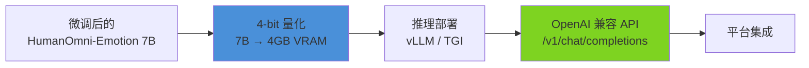

# AI 情感 Agent 平台 — 专用情感模型设计

> 文档状态: 设计稿

---

## 目录

1. [背景与动机](#1-背景与动机)
2. [方案对比](#2-方案对比)
3. [基座模型选型：HumanOmni](#3-基座模型选型humanomni)
4. [数据准备](#4-数据准备)
5. [微调训练管线](#5-微调训练管线)
6. [验证与评估](#6-验证与评估)
7. [平台集成架构](#7-平台集成架构)
8. [演进路线](#8-演进路线)
9. [风险与缓解](#9-风险与缓解)

---

## 1. 背景与动机

### 1.1 通用 LLM 兜底的局限性

平台的基础情感计算采用**三级检测流水线**（Emoji → Keyword → LLM 兜底），在轻量场景下表现良好。但 LLM 兜底层存在根本性问题：

| 问题 | 具体表现 | 根因 |
|------|---------|------|
| **JSON 输出不稳定** | ~85% 成功率，偶发格式错误、字段缺失 | 通用 LLM 未针对情感任务微调 |
| **VAD 精度不足** | VAD 三维数值偏差 > 0.1 | 通用 LLM 缺乏情感数值化训练 |
| **隐性情感漏检** | 讽刺、隐喻、含蓄表达识别率低 | 通用 LLM 训练数据中情感标注稀疏 |
| **跨模态能力缺失** | 无法利用语音语调、表情等信号 | 当前架构仅处理文本 |
| **推理成本高** | LLM 兜底每次 ~500ms + token 消耗 | 用 27B 模型做分类任务，过度杀伤 |

### 1.2 核心目标

> **用专用情感模型替代通用 LLM 兜底，覆盖 SentimentCenter 和 EmotionCenter 的 Level 3 检测，将情感识别的准确率、速度、成本推向量变级改进。**

具体指标：

| 指标 | 通用 LLM 兜底 | 专用情感模型 | 目标提升 |
|------|-------------------|---------------|---------|
| 情感极性准确率 | ~85% | ≥ 95% | +10pp |
| 情绪 9 类分类准确率 | ~80% | ≥ 92% | +12pp |
| VAD 三维 MAE | > 0.10 | < 0.05 | 2x 精度 |
| Level 3 检测延迟 | ~500ms | < 50ms | 10x 提速 |
| Level 3 单次成本 | ~¥0.0064 | < ¥0.0005 | 10x 降本 |
| 隐性情感（讽刺/隐喻） | 不可靠 | 可靠识别 | — |

---

## 2. 方案对比

### 2.1 可选技术路线

| 方案 | 模型规模 | 训练成本 | 推理成本 | 精度上限 | 多模态 | 工期 |
|------|---------|---------|---------|---------|-------|------|
| **A: Fine-tune 情感专用 LLM**（推荐） | 7B | 中 | 低 | 高 | 可扩展 | 4-6 周 |
| B: 轻量分类器（BERT-based） | 300M | 低 | 极低 | 中 | 否 | 2-3 周 |
| C: 直接使用 HumanOmni Omni 模型 | 7B | 无 | 中 | 高 | 是 | 1 周 |
| D: 自研情感模型 | — | 极高 | — | 未知 | — | 6 月+ |

### 2.2 选定方案：A

**理由**：
- HumanOmni 已提供完整的微调框架和情感数据集接口，无需从零训练
- 7B 模型微调后推理速度足够（量化后 < 50ms）
- 保留未来扩展为多模态的路径（HumanOmni 原生支持视频+音频）
- 相比方案 C（直接使用），微调可以让模型适应平台特定的情感标签体系和 VAD 输出格式

---

## 3. 基座模型选型：HumanOmni

### 3.1 为什么选择 HumanOmni

HumanOmni 是业界首个面向人类场景的全模态大模型，在情感识别任务上显著优于通用模型：

| 模型 | DFEW (WAR) | MAFW (WAR) | DFEC-AutoDQ | 参数量 |
|------|-----------|-----------|------------|--------|
| 通用 LLM (Qwen3.6-27B) | ~65% | ~55% | — | 27B |
| Emotion-LLaMA | 77.06% | — | — | 7B |
| MMA-DFER | 77.43% | 58.45% | — | — |
| **HumanOmni (Video-Audio)** | **81.82%** | **66.50%** | **0.523** | **7B** |
| HumanOmni (Video Only) | 70.62% | 59.58% | 0.510 | 7B |
| HumanOmni (Audio Only) | 58.63% | 51.33% | — | 7B |

HumanOmni 在 DFEW 数据集上比通用 LLM 高出 **16pp+**。

### 3.2 HumanOmni 架构要点

```
输入: 视频 + 音频（可选）
    │
    ▼
┌─────────────────────────────────────┐
│  Three Branches (自适应融合)          │
│  ├── Face-related Branch            │
│  │   人脸表情特征提取                  │
│  ├── Body-related Branch            │
│  │   肢体语言特征提取                  │
│  └── Interaction-related Branch     │
│      人物交互特征提取                   │
└──────────────┬──────────────────────┘
               │
               ▼
┌─────────────────────────────────────┐
│  Audio Projector + Video Projector   │
│  (视觉/听觉特征投影)                  │
└──────────────┬──────────────────────┘
               │
               ▼
┌─────────────────────────────────────┐
│  LLM Decoder (Qwen2.5-7B)           │
│  指令跟随 + 多模态推理                │
└─────────────────────────────────────┘
```

### 3.3 三阶段预训练流程

HumanOmni 的训练本身就是三阶段渐进式，我们将在其基础上进行第四阶段微调：

```
Stage 1: Visual Capability Construction
  └── 模型: HumanOmni-7B-Video
  └── 学习时空特征表示

Stage 2: Auditory Capability Development  
  └── 模型: HumanOmni-7B-Audio
  └── 学习语音理解和音频特征

Stage 3: Cross-Modal Interaction Integration
  └── 模型: HumanOmni-7B-Omni（全量）
  └── 视觉-听觉协同推理

═══════════════════════════════════════
Stage 4: Emotion-Specific Fine-tuning (我们)
  └── 模型: HumanOmni-Emotion（专用情感模型）
  └── 在平台数据集上微调
```

---

## 4. 数据准备

### 4.1 数据来源

| 数据集 | 规模 | 情感标签 | 模态 | 用途 |
|--------|------|---------|------|------|
| **DFEW** | 16,000+ 视频片段 | 7 类（恐惧/愤怒/惊讶/开心/中性/悲伤/厌恶） | 视频+音频 | 基础情感分类训练 |
| **MAFW** | 10,000+ 视频片段 | 11 类（含复合情感） | 视频+音频 | 复合情感识别 |
| **CAER** | 13,000+ 视频片段 | 7 类 | 视频 | 情境情绪识别 |
| **FERV39k** | 39,000+ 视频片段 | 7 类 | 视频 | 大规模情感数据 |
| **平台积累数据** | 逐步构建 | 平台 9 类标签体系 | 文本 | 领域适应微调 |

### 4.2 标签映射

HumanOmni 原始使用的 DFEW/MAFW 标签体系与平台 9 类 VAD 标签体系需要对齐映射：

```
HumanOmni 标签        → 平台 9 类 + VAD
─────────────────────────────────────
happy                 → joy (V=0.85, A=0.75, D=0.70)
sad                   → sadness (V=0.20, A=0.35, D=0.30)
angry                 → anger (V=0.15, A=0.85, D=0.75)
fear                  → fear (V=0.20, A=0.80, D=0.25)
surprise              → surprise (V=0.50, A=0.80, D=0.45)
disgust               → anger (V=0.15, A=0.85, D=0.75) [归并]
neutral               → neutral (V=0.50, A=0.30, D=0.50)
—                     → love (V=0.90, A=0.65, D=0.55) [平台特有]
—                     → anxiety (V=0.25, A=0.75, D=0.30) [平台特有]
—                     → gratitude (V=0.85, A=0.50, D=0.55) [平台特有]
```

**处理策略**：
- DFEW/MAFW 的 `disgust` 归并到 `anger`（相邻 VAD 空间）
- `love` / `anxiety` / `gratitude` 为平台特有标签，通过以下方式补充：
  1. 使用 GPT-4o 或 Qwen3.6 对 DFEW/MAFW 数据进行重标注（添加平台标签）
  2. 构建平台特定情感数据集（从现有对话日志中提取）

### 4.3 数据格式（HumanOmni 兼容）

HumanOmni 的微调数据格式为 JSON：

```json
[
    {
        "video": "data/dfew/videos/001.mp4",
        "conversations": [
            {
                "from": "human",
                "value": "<video>\n<audio>\nAs an emotional recognition expert; throughout the video, which emotion conveyed by the characters is the most obvious to you?\nfear, angry, surprise, happy, neutral, sad, disgust"
            },
            {
                "from": "gpt",
                "value": "sad"
            }
        ]
    }
]
```

**平台扩展格式**（增加 VAD 输出）：

```json
[
    {
        "video": "data/dfew/videos/001.mp4",
        "conversations": [
            {
                "from": "human",
                "value": "<video>\n<audio>\nAnalyze the emotion in this video. Return the primary emotion, VAD values, and intensity.\nEmotions: joy, sadness, anger, fear, surprise, love, anxiety, gratitude, neutral"
            },
            {
                "from": "gpt",
                "value": "{\"emotion\": \"sadness\", \"intensity\": 0.7, \"V\": 0.20, \"A\": 0.35, \"D\": 0.30}"
            }
        ]
    }
]
```

### 4.4 文本模式数据（纯文本情感识别）

对于平台当前主要处理文本对话的场景，需要构建文本情感数据集：

```
输入: "最近工作压力很大，感觉快撑不住了"
输出: {"emotion": "anxiety", "intensity": 0.8, "V": 0.25, "A": 0.75, "D": 0.30}

输入: "谢谢你一直陪着我，真的非常感谢"
输出: {"emotion": "gratitude", "intensity": 0.9, "V": 0.85, "A": 0.50, "D": 0.55}

输入: "今天面试通过了！太开心了😊"
输出: {"emotion": "joy", "intensity": 0.9, "V": 0.85, "A": 0.75, "D": 0.70}
```

**数据构建策略**：

| 方法 | 规模 | 质量 | 成本 | 优先级 |
|------|------|------|------|--------|
| 现有情感数据集转换 | 50,000+ | 高 | 低 | P0 |
| GPT-4o 合成标注（带 VAD） | 20,000+ | 中高 | 中 | P0 |
| 平台对话日志人工标注 | 5,000+ | 极高 | 高 | P1 |
| 对抗样本生成（讽刺/隐喻） | 2,000+ | 高 | 中 | P1 |

---

## 5. 微调训练管线

### 5.1 环境准备

```
硬件要求:
  GPU: 4× A100 80GB (推荐) / 8× RTX 4090 (最低)
  RAM: ≥ 256GB
  存储: ≥ 500GB SSD

软件环境:
  框架: PyTorch 2.1+ / Transformers 4.38+
  加速: Flash Attention 2 / DeepSpeed ZeRO-3
  量化: bitsandbytes (推理时 4-bit 量化)
  环境: Conda (参考 HumanOmni 官方设置)
```

### 5.2 模型权重准备

从 HuggingFace 或 ModelScope 下载 HumanOmni 权重：

```bash
# HuggingFace
git lfs install
git clone https://huggingface.co/StarJiaxing/HumanOmni-7B

# 或 ModelScope
git lfs install
git clone https://modelscope.cn/models/iic/HumanOmni-7B.git
```

所需权重文件：

| 权重 | 大小 | 来源 |
|------|------|------|
| HumanOmni-7B-Video | ~15GB | Stage 1 预训练 |
| HumanOmni-7B-Audio | ~15GB | Stage 2 预训练 |
| HumanOmni-7B-Omni | ~15GB | Stage 3 全量（微调起点） |

### 5.3 微调策略

采用 **LoRA (Low-Rank Adaptation)** 微调，保持大部分参数冻结，仅训练 adapter 层：

```
策略选择:
  ├── Full Fine-tune (全量微调)
  │   ├── 效果: 最优
  │   ├── 成本: 4× A100, ~3 天
  │   └── 适用: 最终生产版本
  │
  └── LoRA / QLoRA (高效微调) ← 推荐
      ├── 效果: 接近全量微调
      ├── 成本: 1× RTX 4090, ~12 小时
      └── 适用: 快速迭代验证
```

**LoRA 配置**：

```yaml
lora:
  r: 64                    # LoRA 秩
  lora_alpha: 128          # 缩放因子
  target_modules:          # 目标模块
    - "q_proj"
    - "k_proj"
    - "v_proj"
    - "o_proj"
    - "gate_proj"
    - "up_proj"
    - "down_proj"
  lora_dropout: 0.05       # Dropout
  bias: "none"
  task_type: "CAUSAL_LM"
```

### 5.4 训练参数

```yaml
training:
  # 数据
  per_device_train_batch_size: 4
  per_device_eval_batch_size: 4
  gradient_accumulation_steps: 8    # 有效 batch size = 32
  num_train_epochs: 5               # 总轮次
  
  # 学习率
  learning_rate: 2e-4
  lr_scheduler_type: "cosine"
  warmup_ratio: 0.03
  
  # 优化器
  optim: "adamw_torch"
  weight_decay: 0.01
  max_grad_norm: 1.0
  
  # 精度
  bf16: true                        # BF16 混合精度
  tf32: true                        # TF32 加速
  
  # 评估
  evaluation_strategy: "steps"
  eval_steps: 100
  save_strategy: "steps"
  save_steps: 100
  save_total_limit: 3
  
  # 分布式
  deepspeed: "configs/ds_zero3.json"  # ZeRO-3 优化
  gradient_checkpointing: true
```

### 5.5 三阶段微调方案

借鉴 HumanOmni 的三阶段训练设计，平台微调也采用分阶段策略：

```
Phase A: 情感分类微调（P0）
  ├── 目标: 9 类情感分类准确率 ≥ 92%
  ├── 数据: DFEW + MAFW + 文本情感数据（共 80,000+ 样本）
  ├── 训练: LoRA, 5 epochs
  └── 评估: DFEW test set, 平台测试集

Phase B: VAD 回归微调（P0）
  ├── 目标: VAD 三维 MAE < 0.05
  ├── 数据: 带 VAD 标注的数据（共 50,000+ 样本）
  ├── 训练: LoRA, 3 epochs (在 Phase A 基础上继续)
  └── 评估: VAD 回归测试集

Phase C: 对抗鲁棒性微调（P1）
  ├── 目标: 讽刺/隐喻/含蓄表达识别率 ≥ 85%
  ├── 数据: 对抗样本（共 5,000+ 样本）
  ├── 训练: LoRA, 3 epochs (在 Phase B 基础上继续)
  └── 评估: 对抗测试集
```

### 5.6 强化学习优化（RLHF）

在监督微调（SFT）完成后，引入强化学习进一步对齐情感打分质量与人类判断，降低偶发偏差：

```
                                      ┌──────────────┐
                                      │  Reward Model │
                                      │  评分器       │
                                      └──────┬───────┘
                                             │ 奖励信号
┌─────────┐   动作(情感输出)   ┌──────────┐  │
│  Policy  │────────────────▶ │  Environment │  │
│  HumanOmni│                  │  对话上下文   │◄─┘
│  -Emotion │◀──────────────── │  + 评估     │
│          │   奖励/更新梯度    │              │
└─────────┘                   └──────────────┘
```

#### 5.6.1 奖励模型训练

| 组件 | 说明 |
|------|------|
| **奖励信号源** | 人工标注的 VAD 评分偏好对（A > B）+ GPT-4o 合成偏好对 |
| **奖励模型架构** | 基于 Qwen2.5-0.5B，拼接情感分类 head，输出标量评分 (0-1) |
| **训练数据** | 5,000+ 偏好对（人工 1000 + GPT-4o 合成 4000） |
| **优化目标** | Bradley-Terry 偏好模型：P(y⁺ > y⁻) = σ(r(y⁺) - r(y⁻)) |

```yaml
reward_model:
  base_model: "Qwen2.5-0.5B"
  head: "linear(4096 → 1) + sigmoid"
  loss: "binary_cross_entropy"
  data:
    source: "human_annotation + gpt_synthesis"
    size: 5000+ preference_pairs
  training:
    epochs: 3
    lr: 1e-5
    batch_size: 16
```

#### 5.6.2 PPO 微调

将训练好的奖励模型作为评分器，对 HumanOmni-Emotion 进行 PPO 强化学习优化：

```
PPO 训练循环:

for each iteration:
  1. 采样 batch: 从数据集中取出 N 条对话上下文
  2. Policy 推理: HumanOmni-Emotion 生成情感标签 + VAD
  3. Reward 计算: Reward Model 对输出评分
  4. KL 惩罚: 计算与 SFT 基座策略的 KL 散度
  5. PPO 更新:
     loss = -E[ min(ratio × A, clip(ratio, 1-ε, 1+ε) × A) ] + β × KL(π || π_base)
     ratio = π_new(a|s) / π_old(a|s)   # 重要性采样比
     A     = reward - baseline           # 优势函数
     ε     = 0.2                         # 裁剪范围
     β     = 0.04                        # KL 惩罚系数
```

**PPO 训练参数**：

```yaml
ppo_training:
  # 数据采样
  ppo_epochs: 4                         # 每个 batch 的 PPO 轮次
  mini_batch_size: 64                   # 小批次
  batch_size: 256                       # 采样 batch
  
  # PPO 超参
  clip_range: 0.2                       # 裁剪阈值 ε
  kl_penalty: "adaptive"                # 自适应 KL (β 动态调整)
  target_kl: 0.1                        # 目标 KL 值
  vf_coef: 0.5                          # Value function loss 系数
  
  # 学习率
  learning_rate: 1e-6                   # 低 lr 防止灾难性遗忘
  lr_scheduler: "constant"
  
  # Reward
  reward_normalization: true            # 归一化奖励
  gamma: 0.99                           # 折扣因子
  gae_lambda: 0.95                      # GAE λ 参数
  
  # 分布式
  deepspeed_stage: 2                    # ZeRO-2
```

#### 5.6.3 RL 评估指标

| 指标 | 说明 | SFT 基线 | RL 目标 |
|------|------|---------|---------|
| Reward Score | 奖励模型平均分 | 0.75 | ≥ 0.85 |
| VAD 人类一致性 | 与人工标注的相关系数 | 0.80 | ≥ 0.88 |
| 极端值偏差异常率 | VAD 偏离人类判断比例 | 5% | < 2% |
| 分类准确率退化 | RL 后情感分类指标 | ≥ 92% | ≤ 1% 退化 |

#### 5.6.4 RL 风险与缓解

| 风险 | 缓解措施 |
|------|---------|
| Reward Hacking | 设置输出格式约束（JSON Schema 强制验证）+ 异常值检测哨兵 |
| 灾难性遗忘 | KL 惩罚 + 保留 20% SFT 数据混合训练 + EWC |
| 模型坍缩 | 监控 KL 散度 + PPO entropy 奖励保熵 |
| 奖励模型偏差 | 多模型奖励集成（3× Reward Model 投票） |

### 5.7 推理优化

微调完成后，对模型进行推理优化以满足生产环境延迟要求：



| 优化技术 | 效果 | 实现方式 |
|---------|------|---------|
| 4-bit 量化 (NF4) | 显存从 14GB → 4GB | bitsandbytes + transformers |
| Flash Attention 2 | 推理速度 2x | 替换 attention 计算 |
| vLLM 部署 | 并发吞吐量 10x | PagedAttention |
| 文本模式跳过视觉分支 | 推理速度 5x | 根据输入模态选择分支路径 |

**优化后性能预估**：

| 指标 | 优化前 | 优化后 |
|------|-------|-------|
| 模型大小 | 14 GB | 4 GB |
| 单次推理延迟 | ~200ms (A100) | ~30ms (A100) / ~50ms (RTX 4090) |
| 并发能力 | 4 请求/GPU | 40+ 请求/GPU (vLLM) |
| 硬件要求 | A100 80GB | RTX 4090 24GB |

---

## 6. 验证与评估

### 6.1 离线评估（训练阶段）

| 任务 | 评估指标 | 目标值 | 测试集 |
|------|---------|--------|--------|
| 情感分类 | Accuracy / Macro F1 | ≥ 92% / ≥ 0.88 | DFEW test set |
| 情感分类 | Accuracy | ≥ 90% | MAFW test set |
| 9 类分类 | Accuracy / Macro F1 | ≥ 88% / ≥ 0.84 | 平台测试集 |
| VAD 回归 | MAE (V / A / D) | < 0.05 / < 0.06 / < 0.06 | VAD 测试集 |
| 对抗样本 | Accuracy | ≥ 85% | 对抗测试集 |
| 推理速度 | 延迟 (p50 / p95) | < 50ms / < 100ms | — |

### 6.2 在线评估（集成后）

| 评估维度 | 方法 | 对比基准 | 目标 |
|---------|------|---------|------|
| 极性准确率 | 与基线（通用 LLM 兜底）对比，1000 条随机采样 | ~85% | > 95% |
| 情绪分类准确率 | 与基线对比 | ~80% | > 92% |
| Level 3 调用率 | 统计专用模型被调用的频率 | 100% LLM 兜底 | 专用模型替代率 100% |
| 端到端延迟 | 全管线延迟对比 | ~500ms | < 100ms |
| 成本对比 | 每万次检测成本 | ¥64 | < ¥5 |

### 6.3 模型发布标准

模型达到以下全部标准方可发布为 `HumanOmni-Emotion-v1`：

```
□ 情感分类准确率 ≥ 92% (DFEW test)
□ 9 类分类准确率 ≥ 88% (平台测试集)
□ VAD MAE < 0.05 (V) / < 0.06 (A) / < 0.06 (D)
□ 对抗样本准确率 ≥ 85%
□ 推理延迟 < 50ms (p50)
□ 无灾难性遗忘（在通用情感数据上不退化）
```

---

## 7. 平台集成架构

### 7.1 集成位置

专用模型作为 **EmotionCenter 和 SentimentCenter 的 Level 3 替代**，替换当前的通用 LLM 兜底：

```
Level 1: Emoji 解析 (置信度 0.90+)
Level 2: 关键词匹配 (置信度 0.70+)
Level 3: HumanOmni-Emotion 专用模型
```

### 7.2 架构变更

```
情感计算架构:

用户消息 ──────→ SentimentCenter ─→ Level 1 Emoji → Level 2 Keyword → Level 3 HumanOmni-Emotion
         │    → EmotionCenter   ─→ Level 1 Emoji → Level 2 Keyword → Level 3 HumanOmni-Emotion
         │
         └────→ 可选: 多模态输入（视频/音频/图片）
                 └→ HumanOmni-Emotion (原生多模态支持)
```

### 7.3 配置化启用/降级

专用模型通过配置驱动开关，未启用时自动降级为通用 LLM 兜底：

```yaml
# 平台配置 — platform.yaml
emotion_detector:
  dedicated_model:
    enabled: true              # true=专用模型, false=LLM兜底
    provider: "humanomni"
    endpoint: "http://gpu-cluster:8000/v1"
    model_name: "HumanOmni-Emotion-v1"
    fallback_on_error: true    # 推理失败自动降级到 LLM
```

**运行时决策逻辑**：

```
Level 3 检测:
  1. 读取配置 dedicated_model.enabled
     ├── true  → 选择 HumanOmni-Emotion Provider
     │           ├── 调用成功 → 返回 EmotionResult
     │           └── 调用失败 + fallback_on_error
     │               └── 降级到 LLM 兜底 Provider
     │
     └── false → 直接走通用 LLM 兜底 (Qwen3.6-27B)
```

**配置化 Provider 选择**：

```go
// pkg/emotion/detector.go — 配置化创建
type DetectorConfig struct {
    DedicatedModel struct {
        Enabled         bool   // true=专用模型, false=LLM兜底
        Provider        string // "humanomni"
        Endpoint        string // GPU 推理集群地址
        ModelName       string // "HumanOmni-Emotion-v1"
        FallbackOnError bool   // 失败时降级
    }
}

func NewDetector(cfg DetectorConfig) *Detector {
    var level3 EmotionProvider
    
    if cfg.DedicatedModel.Enabled {
        level3 = humanomni.NewHumanOmniProvider(
            cfg.DedicatedModel.Endpoint,
            cfg.DedicatedModel.ModelName,
        )
    } else {
        // 降级到通用 LLM
        level3 = llm.NewLLMFallbackProvider()
    }
    
    detector := &Detector{
        level3:         level3,
        fallbackOnErr:  cfg.DedicatedModel.FallbackOnError,
        fallbackLLM:    llm.NewLLMFallbackProvider(), // 用于容错
    }
    return detector
}

// Classify — 调用时带自动降级
func (d *Detector) Classify(ctx context.Context, text string) (*EmotionResult, error) {
    result, err := d.level3.Classify(ctx, text)
    if err != nil && d.fallbackOnErr {
        log.Warn("dedicated model failed, fallback to LLM")
        return d.fallbackLLM.Classify(ctx, text)
    }
    return result, err
}
```

**配置变更效果**：

| 配置 | 效果 |
|------|------|
| `enabled: true` | Level 3 走 HumanOmni-Emotion 专用模型 |
| `enabled: false` | Level 3 走通用 LLM 兜底 |
| `fallback_on_error: true` | 专用模型不可用时自动降级 |
| `fallback_on_error: false` | 专用模型失败则直接报错 |

### 7.4 Provider 接口扩展

在 `pkg/provider/` 层新增 `EmotionProvider` 接口：

```go
// pkg/provider/provider.go — 新增

// EmotionProvider 专用情感模型接口
type EmotionProvider interface {
    // Classify 文本情感分类
    // 返回 9 类情感 + 置信度
    Classify(ctx context.Context, text string) (*EmotionResult, error)
    
    // ClassifyVAD 文本 VAD 三维预测
    // 返回 Valence, Arousal, Dominance 连续值
    ClassifyVAD(ctx context.Context, text string) (*VADResult, error)
    
    // ClassifyMultiModal 多模态情感识别（未来）
    // 支持视频+音频+文本联合输入
    ClassifyMultiModal(ctx context.Context, input *MultiModalInput) (*EmotionResult, error)
}

type EmotionResult struct {
    Emotion    string  // joy/sadness/anger/fear/surprise/love/anxiety/gratitude/neutral
    Intensity  float64 // 0.0 ~ 1.0
    Confidence float64 // 0.0 ~ 1.0
    VAD        *VADResult
}

type VADResult struct {
    Valence   float64 // 0.0 ~ 1.0
    Arousal   float64 // 0.0 ~ 1.0
    Dominance float64 // 0.0 ~ 1.0
}
```

### 7.4 HumanOmni-Emotion Provider 实现

```go
// pkg/provider/humanomni/provider.go — 新增

type HumanOmniProvider struct {
    client  *OpenAIClient  // HumanOmni 通过 OpenAI 兼容 API 部署
    model   string         // "HumanOmni-Emotion-v1"
}

func (p *HumanOmniProvider) Classify(ctx context.Context, text string) (*EmotionResult, error) {
    resp, err := p.client.Chat(ctx, &ChatRequest{
        Model: p.model,
        Messages: []Message{
            {
                Role: "user",
                Content: buildEmotionPrompt(text),
            },
        },
        Temperature: 0.1,     // 低温度确保确定性输出
        MaxTokens:   50,       // 只需要情感标签
    })
    if err != nil {
        return nil, err
    }
    return parseEmotionResponse(resp.Content)
}

func (p *HumanOmniProvider) ClassifyVAD(ctx context.Context, text string) (*VADResult, error) {
    resp, err := p.client.Chat(ctx, &ChatRequest{
        Model: p.model,
        Messages: []Message{
            {
                Role: "user",
                Content: buildVADPrompt(text),
            },
        },
        Temperature: 0.1,
        MaxTokens:   100,      // 需要 JSON 格式的 VAD 值
    })
    if err != nil {
        return nil, err
    }
    return parseVADResponse(resp.Content)
}
```

### 7.5 Pipeline 集成

```go
// 创建管线时注入 HumanOmni Provider
emotionProvider := humanomni.NewHumanOmniProvider(cfg)

detector := emotion.NewDetector(
    emotion.WithKeywordPath(),           // Level 1+2: 关键词快路径
    emotion.WithLLMProvider(emotionProvider), // Level 3: HumanOmni-Emotion
    emotion.WithConfidenceThresholds(    // 置信度阈值
        emojiThreshold:   0.90,
        keywordThreshold: 0.70,
        llmThreshold:     0.85,          // 专用模型置信度更高
    ),
)
```

### 7.6 服务部署架构

```
┌─────────────────────────────────────────┐
│  Platform Node (Go)                      │
│  ┌─────────────────────────────────┐    │
│  │  Emotion Detector                │    │
│  │  Level 1: Emoji (本地)           │    │
│  │  Level 2: Keyword (本地)         │    │
│  │  Level 3: gRPC/HTTP → API       │    │
│  └──────────────┬──────────────────┘    │
└─────────────────┼────────────────────────┘
                  │
                  ▼
┌─────────────────────────────────────────┐
│  Model Inference Cluster                 │
│  GPU Node 1 ─ HumanOmni-Emotion         │
│  GPU Node 2 ─ HumanOmni-Emotion         │
│  GPU Node N ─ (水平扩展)                 │
│  ┌─────────────────────────────────┐    │
│  │  vLLM Serving                   │    │
│  │  4-bit 量化, Flash Attention    │    │
│  │  OpenAI 兼容 API 端点            │    │
│  └─────────────────────────────────┘    │
└─────────────────────────────────────────┘
```

---

## 8. 实施路线

### 文本情感专用模型

```
Week 1-2: 数据准备
  ├── 下载 DFEW / MAFW / CAER / FERV39k
  ├── 标签映射（DFEW 7 类 → 平台 9 类 + VAD）
  ├── 文本情感数据集构建（50,000+）
  └── 数据清洗 + 格式转换

Week 3-4: 模型微调
  ├── 环境搭建（GPU 集群 + HumanOmni 框架）
  ├── Phase A：情感分类 LoRA 微调
  ├── Phase B：VAD 回归 LoRA 微调
  └── Phase C：对抗样本微调

Week 5: 评估 + 优化
  ├── 离线评估（准确率 / F1 / MAE）
  ├── 4-bit 量化 + vLLM 部署
  └── 在线 AB 测试（与基线 LLM 兜底对比）

Week 6: 平台集成
  ├── EmotionProvider 接口 + HumanOmni 实现
  ├── Pipeline 集成（Level 3 替换）
  ├── Metrics 追踪（准确率 / 延迟 / 成本对比）
  └── 灰度发布 + 全量切换
```

### Phase 2 — 多模态支持（未来）

```
├── 集成图像输入（用户头像/表情包分析）
├── 集成语音输入（语调/语气情感分析）
├── MultiModalInput 接口扩展
└── HumanOmni 原生多模态能力利用
```

### Phase 3 — 持续学习（未来）

```
├── 平台对话数据回流标注
├── 增量微调（每季度）
├── 模型版本管理与 A/B 测试
└── 个性化情感模型（按 Agent 类型微调）
```

---

## 9. 风险与缓解

| 编号 | 风险 | 概率 | 影响 | 缓解措施 |
|------|------|------|------|---------|
| R1 | HumanOmni 权重不可用/许可证变更 | 低 | 高 | 备选方案：Emotion-LLaMA / Mistral Small 3.1 fine-tune |
| R2 | 微调后灾难性遗忘 | 中 | 中 | 保留通用情感数据验证集，EWC（弹性权重巩固） |
| R3 | 量化后精度下降 | 中 | 中 | 对比 FP16 / 4-bit 精度差异，选择性量化 |
| R4 | 文本模式情感识别精度低于通用 LLM | 低 | 低 | 专用模型仅在 VAD 精度和速度上有优势即可 |
| R5 | GPU 资源不足 | 中 | 高 | 使用 QLoRA (1× RTX 4090 可训)；推理用 CPU+ONNX 回退 |
| R6 | HumanOmni 社区不活跃 | 低 | 中 | 模型架构基于标准 Qwen2.5，可独立维护 |

---

## 附录 A：微调脚本参考（基于 HumanOmni 官方）

```bash
# 基于 HumanOmni 官方微调脚本修改
# 原始: scripts/train/finetune_humanomni.sh

deepspeed --num_gpus=4 \
    src/train/train_humanomni.py \
    --model_name_or_path ./HumanOmni-7B \
    --data_path ./data/platform_emotion_data.json \
    --output_dir ./output/HumanOmni-Emotion-v1 \
    --num_train_epochs 5 \
    --per_device_train_batch_size 4 \
    --per_device_eval_batch_size 4 \
    --gradient_accumulation_steps 8 \
    --learning_rate 2e-4 \
    --weight_decay 0.01 \
    --warmup_ratio 0.03 \
    --lr_scheduler_type "cosine" \
    --bf16 True \
    --tf32 True \
    --gradient_checkpointing True \
    --deepspeed configs/ds_zero3.json \
    --lora_r 64 \
    --lora_alpha 128 \
    --lora_dropout 0.05 \
    --logging_steps 10 \
    --eval_steps 100 \
    --save_steps 100 \
    --save_total_limit 3
```

## 附录 B：HumanOmni-Emotion 模型规格

| 属性 | 值 |
|------|-----|
| 基座模型 | HumanOmni-7B (Qwen2.5-7B decoder) |
| 参数量 | 7B |
| 微调方法 | LoRA (r=64, rank=128) |
| 训练硬件 | 4× A100 80GB |
| 训练时间 | ~3 天（全量） / ~12 小时（LoRA） |
| 推理硬件 | 1× RTX 4090 24GB |
| 量化后显存 | ~4GB (4-bit NF4) |
| 推理延迟 | ~30ms (A100) / ~50ms (RTX 4090) |
| 输出格式 | 结构化 JSON (emotion + VAD) |
| 部署方式 | vLLM / TGI，OpenAI 兼容 API |
